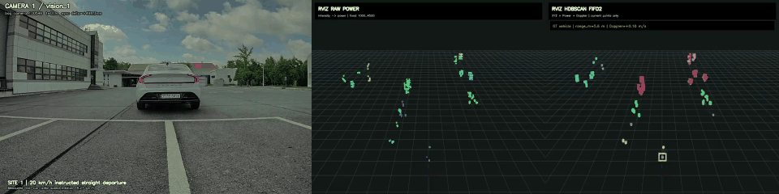
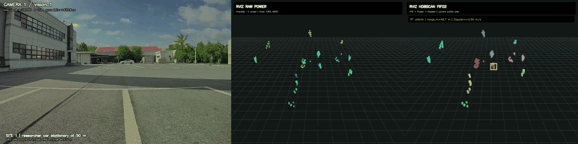
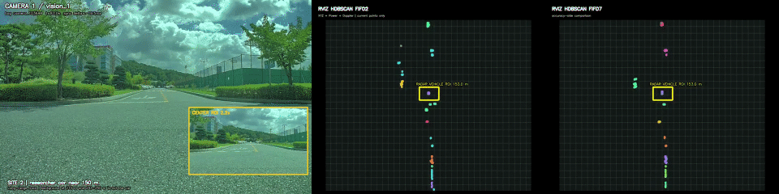
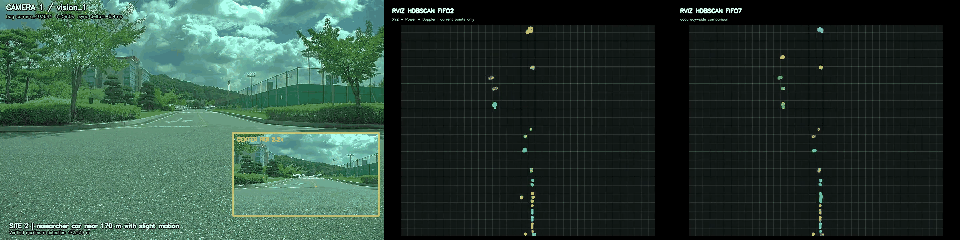
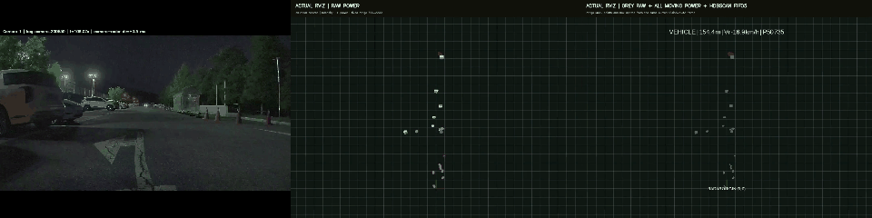
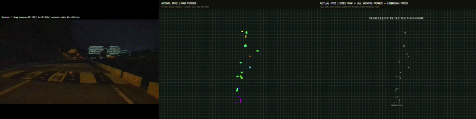

# LRR Vehicle Radar Clustering

The final vehicle pipeline uses external **`hdbscan 0.8.44`** for both the
7-building parking-lot data and the long-range data. `cluster_selection_epsilon`
is HDBSCAN's cluster-selection parameter, not DBSCAN's `eps`.

The former `sklearn.cluster.HDBSCAN` release is preserved on the
[`sklearn-hdbscan` branch](https://github.com/high4ouo/radar-vehicle-clustering/tree/sklearn-hdbscan).
The `main` branch contains the external-HDBSCAN implementation and media only.

## Performance

Parameter selection used development frames only. The first table reports the
92-frame field evaluation split from 2026-08-25; the second reports the
confirmed long-range split from 2026-08-26.

| Dataset and method | Vehicle F1 | Semantic F1 / detection | Over-split | Mean | p95 |
|---|---:|---:|---:|---:|---:|
| 2026-08-25, external HDBSCAN FIFO2 | **0.8568** | 0.9178 | 0.2030 | **27.54 ms** | **31.99 ms** |
| 2026-08-25, external HDBSCAN FIFO7 | 0.8341 | 0.9267 | 0.1842 | 88.59 ms | 107.49 ms |
| 2026-08-25, RETINA-DBSCAN FIFO7 | 0.7943 | **0.9288** | **0.1805** | 292.82 ms | 372.70 ms |
| 2026-08-26, external HDBSCAN FIFO7 | 0.8946 | **1.0000** | 0.0217 | **6.58 ms** | **11.06 ms** |
| 2026-08-26, RETINA-DBSCAN FIFO7 | **0.8993** | **1.0000** | **0.0000** | 14.28 ms | 38.79 ms |

On every labeled frame, external HDBSCAN FIFO2 reached F1 **0.8336** and p95
**34.15 ms** on the 2026-08-25 data. External HDBSCAN FIFO7 reached F1
**0.9113** and p95 **10.50 ms** on the 2026-08-26 data. The 50 ms comparison
covers clustering and post-merge only, not ROS transport or camera inference.

Machine-readable summaries and exact profiles are in [`results`](results/).

## Results

The camera frames, rosbag intervals, video layout, resolution, and frame rate
match the former release. Only the HDBSCAN implementation, tuned parameters,
and resulting cluster overlays changed.

### Parking departure

[](videos/parking_lot/away20_hdbscan_fifo2.mp4)

### Static vehicle at about 50 m

[](videos/parking_lot/static50_hdbscan_fifo2.mp4)

### Static vehicle at 150 m

[](videos/long_range/150m_fifo2_fifo7.mp4)

### Vehicle at 170 m

[](videos/long_range/170m_fifo2_fifo7.mp4)

### Approaching vehicle, up to about 175 m

[](videos/long_range/parking_175m.mp4)

### Road sequence, about 50-261 m

[](videos/long_range/road_50m_to_261m.mp4)

## Method

```text
rosbag -> ROI and feature preprocessing -> FIFO accumulation
       -> external hdbscan 0.8.44 -> cluster merging -> labeled CSV
```

| Use | Parameters | Input |
|---|---|---|
| Parking real-time | FIFO2, `min_cluster_size=10`, project `min_samples=5` (library 4), `cluster_selection_epsilon=2.0` | XYZ + Power 0.25 + Doppler 0.40 |
| Parking accuracy | FIFO7, `min_cluster_size=10`, project `min_samples=4` (library 3), `cluster_selection_epsilon=2.0` | XYZ + Power 0.25 + Doppler 0.40 |
| Long-range accuracy | FIFO7, `min_cluster_size=3`, project `min_samples=2` (library 1), `cluster_selection_epsilon=2.5` | XYZ after `abs(Doppler) >= 0.15 m/s` motion gate |

Project `min_samples` includes the point itself. External `hdbscan` does not,
so the shared core subtracts one before constructing the model. Scikit-learn
remains a dependency only for the retained OPTICS/GMM comparison code; the
HDBSCAN path in `main` always constructs `hdbscan.HDBSCAN`.

Cluster colors use persistent track IDs. A color change therefore indicates a
real split, merge, or reacquisition rather than arbitrary per-frame recoloring.
Yellow target boxes and displayed `range_m` values come from the current-frame
vehicle cluster selected against the field GT trajectory.

## Run

```bash
python -m venv .venv
source .venv/bin/activate
pip install -r requirements.txt
source /opt/ros/humble/setup.bash

python code/cluster_parking_lot.py away20 --bag /path/to/rosbag
python code/cluster_long_range_vehicle.py parking_175m --bag /path/to/rosbag
```

- Parking scenes: `away20`, `static50`, `vehicle150`, `vehicle170`
- Long-range scenes: `parking_175m`, `road_261m`

Each script writes one row per radar point with `cluster_label`,
`target_cluster`, and measured clustering runtime. Raw rosbags are not included.

## Acknowledgement

This work was supported by the Electronics and Telecommunications Research
Institute (ETRI).
