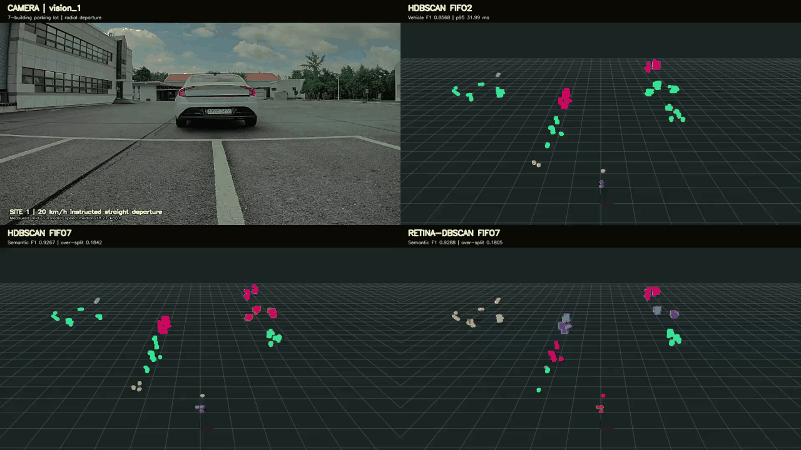

# LRR Vehicle Radar Clustering

LRR vehicle returns are clustered from XYZ, distance-normalized Power, Doppler,
and FIFO temporal context using HDBSCAN.

## Performance

[](videos/main_performance_comparison_4up.mp4)

The camera and all three RViz panels show the same 10-second parking-lot
departure at 10 fps.

| Method | Vehicle F1 ↑ | Semantic F1 ↑ | Over-split ↓ | p95 ↓ |
|---|---:|---:|---:|---:|
| **HDBSCAN FIFO2** | **0.8568** | 0.9178 | 0.2030 | **31.99 ms** |
| **HDBSCAN FIFO7** | 0.8341 | 0.9267 | 0.1842 | 107.49 ms |
| **RETINA-DBSCAN FIFO7** | 0.7943 | **0.9288** | **0.1805** | 372.70 ms |

Results are from 92 labeled frames recorded on 2026-08-25. Vehicle F1 measures
target-vehicle point separation; semantic F1 measures object-level detection;
over-split measures unnecessary fragmentation. Runtime covers clustering and
post-merge on the evaluation machine. FIFO2 is the only configuration below the
radar's 50 ms frame period at p95.

Machine-readable metrics and tuned profiles are in [`results`](results/).
All synchronized recordings are in the [`video gallery`](videos/).

## Reproduce

```bash
python -m venv .venv
source .venv/bin/activate
pip install -r requirements.txt
source /opt/ros/humble/setup.bash

python code/cluster_parking_lot.py away20 --bag /path/to/rosbag
python code/cluster_long_range_vehicle.py parking_175m --bag /path/to/rosbag
```

Parking scenes are `away20`, `static50`, `vehicle150`, and `vehicle170`.
Long-range scenes are `parking_175m` and `road_261m`. Each run writes one row per
radar point with `cluster_label`, `target_cluster`, and clustering runtime. Raw
rosbags are not included.

## Acknowledgement

This work was supported by the Electronics and Telecommunications Research
Institute (ETRI).
