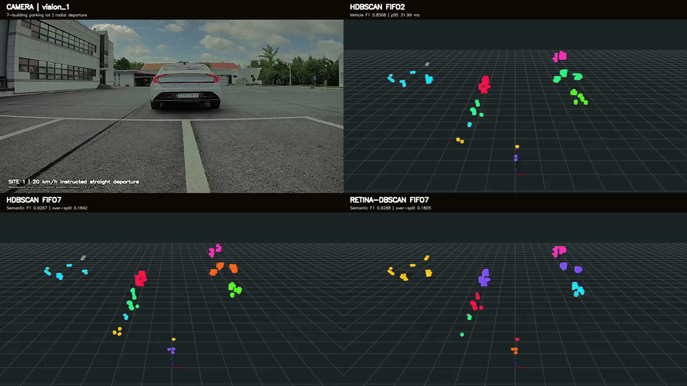
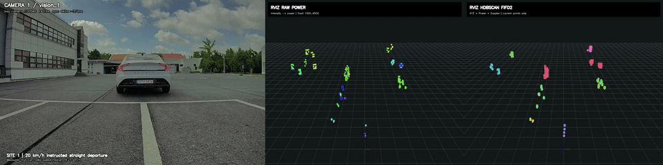
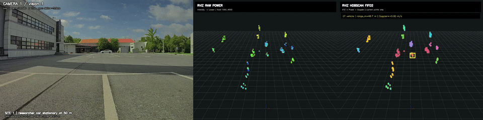
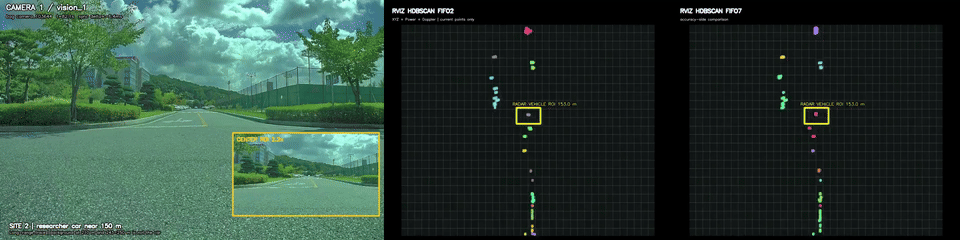
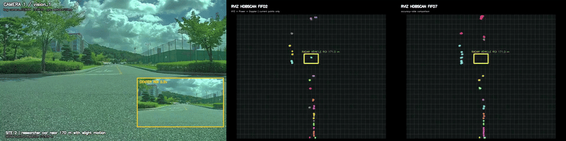
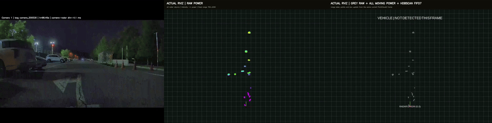
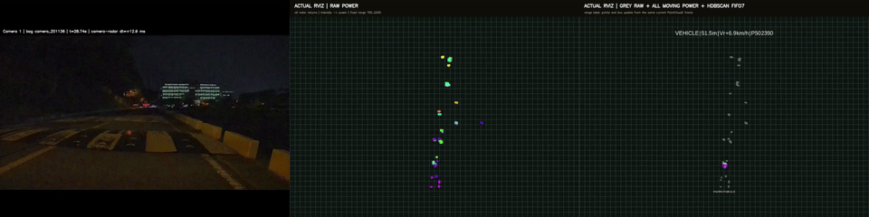

# Video Gallery

Click a preview to open the full MP4.

## Performance comparison

## Parking departure

## Static vehicle at about 50 m

## Static vehicle at 150 m

## Vehicle at 170 m

## Approaching vehicle, up to about 175 m

## Road sequence, about 50-261 m

